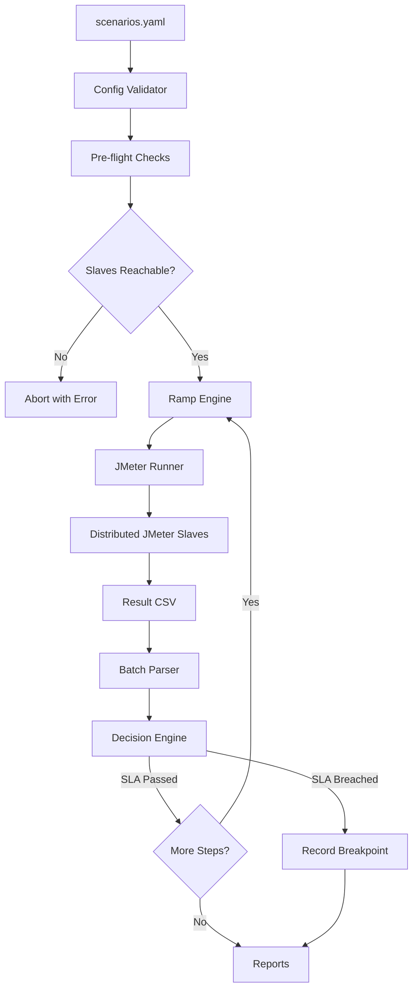

# 🚀 NixPerf-Orchestrator™

**Autonomous Distributed Performance Automation Engine**


NixPerf-Orchestrator™ is an open-source, config-driven load escalation engine that autonomously executes distributed JMeter performance tests, evaluates results against SLA thresholds, and identifies system breakpoints — without manual intervention.

Developed by **Nixsoft Technologies Pvt. Ltd.** — [https://www.nixsoftech.in](https://www.nixsoftech.in)

---

## 🏗 Architecture



---

## 🚀 Overview

NixPerf-Orchestrator™ automates the full lifecycle of distributed performance testing:

- Reads test scenarios from a single YAML configuration file
- Calculates dynamic ramp-up per load step using a configurable strategy
- Executes Apache JMeter in non-GUI distributed mode
- Parses results in streaming batches — memory-safe for files with millions of rows
- Evaluates P95 latency and error rate against defined SLAs
- Identifies the precise breakpoint at which a system degrades
- Generates structured JSON and HTML reports

---

## 📦 Installation

### Requirements

| Component | Minimum Version |
| :--- | :--- |
| Python | 3.10+ |
| Apache JMeter | 5.6+ |
| OS | Linux (recommended for slaves) |
| RAM per slave | 8 GB |
| Open ports | 1099, 50000, 50001 |
| Time sync | NTP / Chrony enabled |

### Setup

```bash
# 1. Clone the repository
git clone https://github.com/praveenkore/NixPerf-Orchestrator.git
cd NixPerf-Orchestrator

# 2. Install Python dependencies
pip install PyYAML

# 3. Ensure jmeter is on PATH
jmeter --version
```

---

## ⚙️ Configuration

All test behaviour is controlled via `config/scenarios.yaml`.

```yaml
scenarios:
  - name: login_test
    jmx_path: scenarios/login.jmx
    load_steps: [500, 1000, 2000, 5000, 10000, 15000]

    ramp_strategy:
      type: constant_arrival   # users injected per second
      arrival_rate: 5          # rampup = users / arrival_rate

    retry_count: 1             # retry on JMeter failure
    timeout_seconds: 7200      # abort if run exceeds 2 hours
    mode: static               # static | adaptive (Phase 2)

    sla:
      p95: 2000                # milliseconds
      error_threshold: 50      # percent
```

### Ramp-Up Strategies

| Strategy | Formula | Required Parameters |
| :--- | :--- | :--- |
| `constant_arrival` | `users / arrival_rate` | `arrival_rate` |
| `fixed` | constant value | `value` |
| `proportional` | `base_ramp × (users / base_users)` | `base_users`, `base_ramp` |

### JMX Requirements

JMeter test plans must use property placeholders for dynamic injection:

- **Threads**: `${__P(users,1)}`
- **Ramp-Up**: `${__P(rampup,60)}`

---

## 🔧 Execution

```bash
# Standard execution
python -m orchestrator.main

# Custom config path
python -m orchestrator.main --config path/to/scenarios.yaml

# Skip pre-flight connectivity checks (CI environments)
python -m orchestrator.main --skip-preflight
```

### Execution Flow

1. Config is loaded and validated — fails fast on schema errors.
2. Pre-flight checks verify slave reachability, disk space, and writable directories.
3. For each scenario, ramp-up is calculated per load step.
4. JMeter is executed in distributed mode with `-Jusers` and `-Jrampup` injected.
5. Results are parsed in configurable batch sizes (default: 10,000 rows/batch).
6. P95 and P99 percentiles are estimated using reservoir sampling (Vitter's Algorithm R).
7. The Decision Engine evaluates metrics against SLA thresholds.
8. The orchestrator proceeds to the next step or records the breakpoint and stops.
9. Reports are written to `reports/`.

---

## 🧠 Ramp-Up & Load Strategy

Ramp-up is calculated dynamically per load step by the `ramp_engine` module. No manual definition is required. The strategy is defined once in YAML and applied automatically at every escalation step.

**Example — `constant_arrival` at 5 users/sec:**

| Load Step | Calculated Ramp-Up |
| :--- | :--- |
| 500 users | 100 s |
| 1,000 users | 200 s |
| 5,000 users | 1,000 s |
| 10,000 users | 2,000 s |

**Production safety guards:**
- Ramp-up is always `>= 1 second`
- Ramp-up is capped at `4 × users` to prevent unreasonable values
- Division-by-zero is handled with a `ValueError`

---

## 📊 Reporting

After each scenario run, two report files are generated in `reports/`:

| Format | Description |
| :--- | :--- |
| `summary_<timestamp>.json` | Structured machine-readable output |
| `summary_<timestamp>.html` | Human-readable summary |

Intermediate results are saved to `results/<scenario>_<users>_<timestamp>.csv`.

---

## 🛡 Security & Compliance

- No credentials or secrets are stored in the codebase.
- All configuration is file-based with no runtime user input.
- Slave connectivity is validated before any test execution.
- Time synchronization (NTP/Chrony) is required across all nodes for accurate distributed timestamps.

For detailed slave setup, persistent kernel tuning, and RMI port configuration, refer to [HELP.md](./HELP.md).

---

## 📄 License

NixPerf-Orchestrator™ is released under the **Apache License 2.0**.

- This software is provided **"AS IS"**, without warranties of any kind.
- Nixsoft Technologies Pvt. Ltd. is not liable for any damages arising from its use or inability to use.
- The Apache License does **not** grant rights to use the **NixPerf-Orchestrator™** trademark.
- This repository contains the **open-source core engine only**. Enterprise features are maintained separately by Nixsoft Technologies Pvt. Ltd.

See [LICENSE](./LICENSE), [NOTICE](./NOTICE), and [TRADEMARKS.md](./TRADEMARKS.md) for full legal details.

---

*Copyright © 2026 Nixsoft Technologies Pvt. Ltd. (https://www.nixsoftech.in/)*
