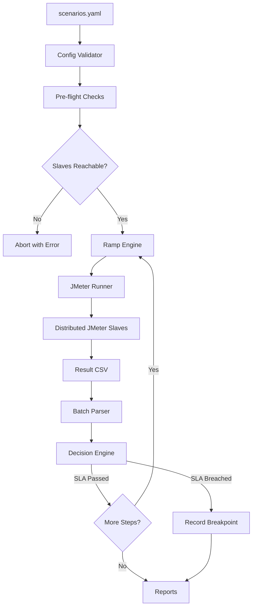

# NixPerf-Orchestrator™

**Autonomous Distributed Performance Automation Engine**


NixPerf-Orchestrator™ is an open-source, config-driven load escalation engine that autonomously executes distributed JMeter performance tests, evaluates results against SLA thresholds, and identifies system breakpoints — without manual intervention.

Developed by **Nixsoft Technologies Pvt. Ltd.** — [https://www.nixsoftech.in](https://www.nixsoftech.in)

---

## Architecture



---

## Overview

NixPerf-Orchestrator™ automates the full lifecycle of distributed performance testing:

- Reads test scenarios from a single YAML configuration file
- Validates configuration schema at startup — fails fast on any misconfiguration
- Calculates dynamic ramp-up per load step using a configurable strategy
- Executes Apache JMeter in non-GUI distributed mode across multiple slave nodes
- Parses results in streaming batches — memory-safe for files with millions of rows
- Evaluates P95 latency and error rate against defined SLAs
- Identifies the precise breakpoint at which a system degrades
- Generates structured JSON and HTML reports with baseline regression detection
- Sends completion notifications via Slack-compatible webhooks and SMTP email

---

## Installation

### Requirements

| Component | Minimum Version |
| :--- | :--- |
| Python | 3.10+ |
| Apache JMeter | 5.6+ |
| OS | Linux (recommended for slaves), Windows / macOS supported for master |
| RAM per slave | 8 GB |
| Open ports | 1099, 50000, 50001 |
| Time sync | NTP / Chrony enabled |

### Setup

```bash
# 1. Clone the repository
git clone https://github.com/praveenkore/NixPerf-Orchestrator.git
cd NixPerf-Orchestrator

# 2. Create and activate a virtual environment
python -m venv myenv

# Windows:
myenv\Scripts\activate
# Linux/macOS:
source myenv/bin/activate

# 3. Install Python dependencies
pip install PyYAML

# 4. Ensure jmeter is on PATH
jmeter --version
```

For detailed environment setup, slave configuration, and troubleshooting, see [HELP.md](./HELP.md).

---

## Configuration

All test behaviour is controlled via `config/scenarios.yaml`.

```yaml
scenarios:
  - name: login_test              # 1–64 alphanumeric / _ / - characters
    jmx_path: scenarios/login.jmx
    load_steps: [500, 1000, 2000, 5000, 10000, 15000]

    ramp_strategy:
      type: constant_arrival      # users injected per second
      arrival_rate: 5             # rampup = users / arrival_rate

    retry_count: 1                # retry on JMeter failure (total = retry_count + 1)
    timeout_seconds: 7200         # hard kill after 2 hours
    mode: static                  # static | adaptive

    sla:
      p95: 2000                   # milliseconds
      error_threshold: 50         # percent

    # Autonomous operation (all optional)
    warmup_users: 10
    cooldown_seconds: 60
    max_consecutive_failures: 2

# Optional — distributed slaves
# slaves:
#   - 192.168.1.10
#   - 192.168.1.11

# Optional — webhook notification on completion
# notification:
#   webhook_url: https://hooks.slack.com/services/XXX/YYY/ZZZ

# Optional — SMTP email notification
# smtp:
#   host: smtp.gmail.com
#   port: 587
#   user: your-email@gmail.com
#   password: env:SMTP_PASSWORD   # reads from environment variable
#   sender: NixPerf <noreply@domain.com>
#   recipient: team@domain.com
```

### Scenario Name Constraints

The `name` field is used as a prefix in checkpoint files and result CSV paths. It must:
- Contain only alphanumeric characters, underscores (`_`), or hyphens (`-`)
- Be between 1 and 64 characters long

The config validator enforces this at startup and rejects invalid names before any test runs.

### Ramp-Up Strategies

| Strategy | Formula | Required Parameters |
| :--- | :--- | :--- |
| `constant_arrival` | `users / arrival_rate` | `arrival_rate` |
| `fixed` | constant value | `value` |
| `proportional` | `base_ramp × (users / base_users)` | `base_users`, `base_ramp` |

**Safety guards:** ramp-up is always clamped to `[1s, users × 4s]`.

### JMX Requirements

JMeter test plans must use property placeholders for dynamic injection:

- **Threads**: `${__P(users,1)}`
- **Ramp-Up**: `${__P(rampup,60)}`

---

## Execution

```bash
# Standard execution
python -m orchestrator.main

# Custom config path
python -m orchestrator.main --config path/to/scenarios.yaml

# Distributed run with Slack notification
python -m orchestrator.main \
  --slaves 10.0.0.1,10.0.0.2 \
  --webhook-url https://hooks.slack.com/services/XXX/YYY/ZZZ

# Skip pre-flight checks (CI environments without slave nodes)
python -m orchestrator.main --skip-preflight

# Force full restart (ignore any saved checkpoint)
python -m orchestrator.main --no-resume
```

### Execution Flow

1. Config is loaded (`.yaml`/`.yml` only) and validated — fails fast on schema errors.
2. Slave addresses are validated: loopback, link-local, and multicast IPs are rejected.
3. Pre-flight checks verify JMeter binary, slave reachability, disk space, and write permissions.
4. For each scenario, the engine resumes from a checkpoint if one exists (unless `--no-resume`).
5. A warmup probe runs at low traffic to prime JVM caches before the first real step.
6. At each load step, ramp-up is calculated, JMeter runs in distributed mode, and results are parsed.
7. P95 / P99 are estimated using reservoir sampling (Vitter's Algorithm R, 100k sample cap).
8. The Decision Engine evaluates metrics and issues `PROCEED`, `WARN`, or `STOP`.
9. A `WARN` triggers a same-step re-test before escalating; persistent degradation converts to `STOP`.
10. Reports are written to `reports/`; baseline regression comparison runs automatically.
11. Webhook and/or email notifications are sent on completion.

---

## Ramp-Up & Load Strategy

Ramp-up is calculated dynamically per load step by the `ramp_engine` module. The strategy is defined once in YAML and applied at every escalation step.

**Example — `constant_arrival` at 5 users/sec:**

| Load Step | Calculated Ramp-Up |
| :--- | :--- |
| 500 users | 100 s |
| 1,000 users | 200 s |
| 5,000 users | 1,000 s |
| 10,000 users | 2,000 s |

---

## Reporting

After all scenarios complete, two report files are generated in `reports/`:

| Format | Description |
| :--- | :--- |
| `summary_<timestamp>.json` | Structured machine-readable output |
| `summary_<timestamp>.html` | Human-readable report with colour-coded decisions |

Raw JMeter result files are written to `results/` with the naming convention:

```
results/<scenario_name>_<jmx_basename>_<users>.csv
```

Including the scenario name prevents two scenarios that share the same JMX file from overwriting each other's results at identical user counts.

The five most recent result files per scenario are retained automatically; older files are pruned after each load step.

---

## Security

| Control | Details |
| :--- | :--- |
| **No hardcoded secrets** | Credentials are never stored in source code. SMTP passwords use `env:VAR_NAME` references. |
| **Scenario name validation** | Names are restricted to `[A-Za-z0-9_-]{1,64}` to prevent path-traversal via checkpoint and result file paths. |
| **Slave address validation** | Loopback (`127.x`, `::1`), link-local (`169.254.x`, `fe80::`), and multicast addresses are rejected at startup. Malformed hostnames are also rejected. |
| **HTTPS-only webhooks** | HTTP webhook URLs are rejected at config-validation time. DNS rebinding is blocked by resolving the hostname and checking every returned IP against the private/reserved ranges. |
| **YAML extension guard** | `--config` only accepts `.yaml` / `.yml` files to prevent accidental reads of arbitrary system files. |
| **HTML escaping** | All user-controlled values are escaped with `html.escape()` before inclusion in HTML reports (XSS prevention). |
| **SSL/TLS for SMTP** | STARTTLS is enforced with `ssl.create_default_context()` (system CA verification). |
| **JMeter path resolution** | The executable is resolved via `shutil.which()` and verified to exist before use. |
| **Disk space check** | At least 500 MB of free disk is required before any test runs (cross-platform via `shutil.disk_usage()`). |

For detailed slave setup, RMI port configuration, and kernel tuning, see [HELP.md](./HELP.md).

---

## Changelog

### v1.1.0 — 2026-04-04

Security hardening and reliability improvements based on comprehensive code review.

**Security**
- Webhook validation now resolves hostnames and checks all returned IPs, closing a DNS-rebinding SSRF vector
- Slave addresses are validated at startup; loopback/link-local/multicast IPs are rejected
- Config loader restricted to `.yaml`/`.yml` files; guards against empty-file `None` return
- Scenario names validated to `[A-Za-z0-9_-]{1,64}` to prevent checkpoint/result path traversal
- Webhook URLs must use `https://` at config-validation time (previously only caught at runtime)
- SMTP env-var name correctly logged when the variable is unset

**Reliability / Logic**
- `clean_old_results()` now uses the JMX-derived filename prefix — result files are actually pruned
- DecisionEngine history is restored from checkpoint on resume — adaptive trend analysis survives restarts
- WARN re-test no longer double-counts the WARN entry in the history slope window
- Original WARN run is preserved in the audit trail before the re-test outcome is appended
- Result CSV names include the scenario name, preventing cross-scenario file collisions
- First resumed step no longer incurs a spurious cooldown
- Empty YAML config raises a clean `ConfigValidationError` instead of crashing with `TypeError`

**Performance**
- File integrity check is now O(1): `stat()` + 512-byte tail seek instead of a full file scan
- `stdout_lines` and `stderr_lines` are bounded deques — memory stays constant over 2-hour runs
- Dedicated stderr drain thread eliminates the pipe-buffer deadlock that could hang the process
- `DecisionEngine._history` uses `deque(maxlen=N)` — O(1) bounded append instead of O(n) list slice
- Disk space check works on all platforms via `shutil.disk_usage()` (previously skipped on Windows)
- Per-line lock removed from stdout drain thread (single writer / post-join read pattern)
- `Metrics.to_dict()` returns a deep copy via `dataclasses.asdict()` instead of a mutable `__dict__` reference

### v1.0.0 — 2026-03-XX

Initial stable release with autonomous operation features: crash recovery, warmup probe, cooldown, WARN re-test, per-step slave health checks, webhook/email notifications, baseline regression detection, and result file retention.

---

## License

NixPerf-Orchestrator™ is released under the **Apache License 2.0**.

- This software is provided **"AS IS"**, without warranties of any kind.
- Nixsoft Technologies Pvt. Ltd. is not liable for any damages arising from its use or inability to use.
- The Apache License does **not** grant rights to use the **NixPerf-Orchestrator™** trademark.
- This repository contains the **open-source core engine only**. Enterprise features are maintained separately by Nixsoft Technologies Pvt. Ltd.

See [LICENSE](./LICENSE), [NOTICE](./NOTICE), and [TRADEMARKS.md](./TRADEMARKS.md) for full legal details.

---

*Copyright © 2026 Nixsoft Technologies Pvt. Ltd. (https://www.nixsoftech.in/)*
